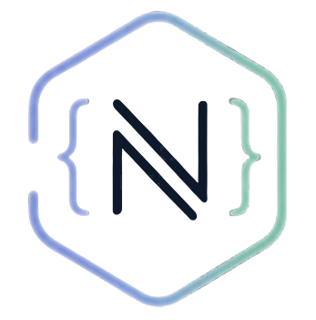

<p align="center">
  <picture>
    <source media="(prefers-color-scheme: dark)" srcset="docs/assets/logo-mark.png">
    
  </picture>
</p>

[](https://github.com/cjfravel-dev/nomos/actions/workflows/ci.yml)
[](https://central.sonatype.com/artifact/dev.cjfravel/nomos-runtime)
[](LICENSE.md)
[](https://www.scala-lang.org/)

**A JSON templating engine for Scala.** Define a template once; nomos generates matching case classes that validate, serialize, and deserialize JSON.

📖 **[Full documentation →](https://cjfravel-dev.github.io/nomos/)**

## Install

Manage versions with the BOM, depend on the runtime, and add the plugin to generate at build time:

```xml
<dependencyManagement>
    <dependencies>
        <dependency>
            <groupId>dev.cjfravel</groupId>
            <artifactId>nomos-bom</artifactId>
            <version>0.0.1-alpha1</version>
            <type>pom</type>
            <scope>import</scope>
        </dependency>
    </dependencies>
</dependencyManagement>

<dependencies>
    <dependency>
        <groupId>dev.cjfravel</groupId>
        <artifactId>nomos-runtime</artifactId>
    </dependency>
</dependencies>

<plugin>
    <groupId>dev.cjfravel</groupId>
    <artifactId>nomos-maven-plugin</artifactId>
    <version>0.0.1-alpha1</version>
    <executions>
        <execution>
            <phase>generate-sources</phase>
            <goals><goal>generate</goal></goals>
        </execution>
    </executions>
</plugin>
```

## Quick look

A template at `src/main/resources/nomos/templates/com/example/models/user.json` (the base package
is derived from the path):

```json
{
  "definitions": [
    { "name": "User", "subPackage": "user",
      "template": { "id": "string", "email": "string", "age": { "$optional": "number" } } }
  ]
}
```

generates a matching case class that can validate, serialize, and deserialize JSON:

```scala
import com.example.models.user.User

User.fromJson("""{"id":"123","email":"j@x.com"}""")     // Either[String, User]

User.validate("""{"id":"123","email":"j@x.com"}""") match {
  case Right(user)  => println(user)
  case Left(errors) => errors.foreach(println)
}
```

## Documentation

Everything lives on the [docs site](https://cjfravel-dev.github.io/nomos/):

- **[Getting Started](https://cjfravel-dev.github.io/nomos/users/getting-started.html)** — install, add the plugin, generate your first types
- **[Template Format](https://cjfravel-dev.github.io/nomos/users/template-format.html)** — fields, optionals, defaults, discriminated unions, enums
- **[Code Generation](https://cjfravel-dev.github.io/nomos/users/code-generation.html)** — what nomos emits and how to use it
- **[Validation](https://cjfravel-dev.github.io/nomos/users/validation.html)** — runtime validation against the embedded template
- **[Maven Plugin](https://cjfravel-dev.github.io/nomos/users/maven-plugin.html)** — plugin goals and configuration

## Runtime JSON API

`nomos-runtime` provides the JSON model that generated code uses: a first-party,
**public, supported, intentionally minimal** immutable tree in `dev.cjfravel.nomos.json` with
parse/write, typed accessors, and single-level transforms. It is **not** a general-purpose JSON
toolkit (no path queries, streaming, schema, or reflection mapping). See the `JsonValue` scaladoc
for the full contract.

## Examples

A complete, runnable example project is in [`nomos-example/`](nomos-example/):

```bash
mvn -f nomos-example/pom.xml test    # regenerates via the installed plugin, then runs the tests
```

## Building

```bash
mvn clean test
```

More in the [contributor guide](https://cjfravel-dev.github.io/nomos/contributors/index.html).

## License

Nomos is licensed under the [MIT License with a SaaS provision](LICENSE.md). © 2026 CJ Fravel.
