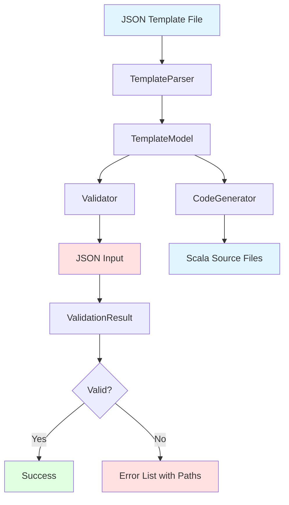
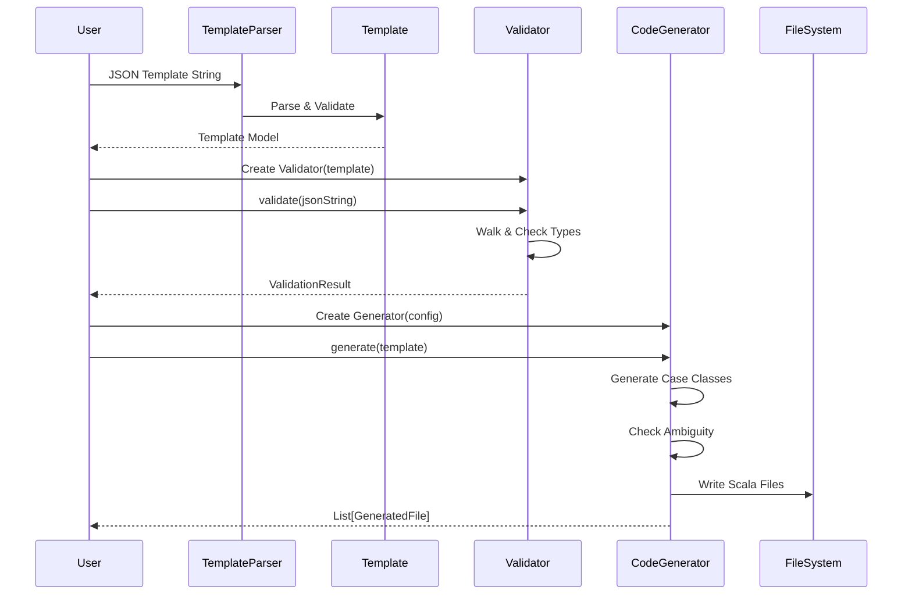
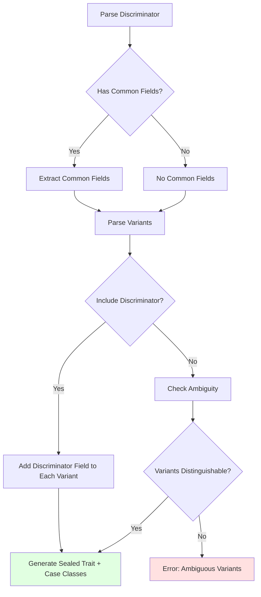

# Nomos Implementation Plan

## Technology Stack

- **Scala Version**: 2.12
- **Build System**: Maven
- **JSON Library**: json4s-native
- **Testing**: ScalaTest

## Design Decisions Summary

### 1. Package Structure
- **Base package**: Configured at runtime/compile-time
- **Sub-packages**: Templates specify relative paths using `subPackage` field
- **Example**: Base `dev.cjfravel.myapp` + template `subPackage: "models.user"` → `dev.cjfravel.myapp.models.user`

### 2. Validation Strategy
- **Comprehensive error collection**: Gather all possible errors in a single pass
- **Stop recursion on error**: Don't recurse deeper if current level has errors, but continue checking siblings
- **Structured errors**: Include field paths (e.g., `users[2].address.zipCode`)

### 3. Type Discriminators
- **Common fields**: Supported across all variants
- **Discriminator field**: Optionally included in case classes (user configurable)
- **Custom field name**: User specifies discriminator field name
- **Ambiguity detection**: Error if variants are indistinguishable without discriminator

### 4. Code Generation
- **Output**: Scala source files written to filesystem
- **Package structure**: Controlled via base package + subPackage specifications
- **File organization**: One file per top-level type

## Architecture Overview



## Core Components

### 1. Template Model

Represents the parsed template structure:

```scala
sealed trait TemplateType
case class StringType(constraints: List[Constraint]) extends TemplateType
case class NumberType(constraints: List[Constraint]) extends TemplateType
case class BooleanType() extends TemplateType
case class ArrayType(elementType: TemplateType) extends TemplateType
case class ObjectType(fields: Map[String, FieldDef]) extends TemplateType
case class TypeDiscriminator(
  fieldName: String,
  variants: Map[String, ObjectType],
  commonFields: Map[String, FieldDef],
  includeInOutput: Boolean
) extends TemplateType
case class RecursiveRef(typeName: String) extends TemplateType

case class FieldDef(
  fieldType: TemplateType,
  optional: Boolean
)

case class Template(
  name: String,
  subPackage: Option[String],
  templateType: TemplateType,
  description: Option[String]
)
```

### 2. Template Parser

Parses JSON template files into `Template` model:

```scala
object TemplateParser {
  def parse(jsonString: String): Either[ParseError, Template]
  
  private def parseType(json: JValue): Either[ParseError, TemplateType]
  private def parseConstraints(json: JValue): List[Constraint]
  private def parseDiscriminator(json: JValue): Either[ParseError, TypeDiscriminator]
}
```

### 3. Validator

Validates JSON against template:

```scala
case class ValidationError(
  path: String,
  message: String,
  expected: String,
  actual: String
)

trait Validator {
  def validate(jsonString: String): Either[List[ValidationError], JValue]
}

class TemplateValidator(template: Template) extends Validator {
  def validate(jsonString: String): Either[List[ValidationError], JValue] = {
    // Parse JSON
    // Walk through template and JSON simultaneously
    // Collect all errors with paths
    // Stop recursion on errors but continue siblings
  }
  
  private def validateType(
    path: String, 
    expected: TemplateType, 
    actual: JValue
  ): List[ValidationError]
  
  private def validateDiscriminator(
    path: String,
    discriminator: TypeDiscriminator,
    actual: JValue
  ): List[ValidationError]
}
```

### 4. Code Generator

Generates Scala case classes:

```scala
case class GeneratorConfig(
  basePackage: String,
  outputDir: String
)

class CodeGenerator(config: GeneratorConfig) {
  def generate(template: Template): Either[GeneratorError, List[GeneratedFile]]
  
  private def generateCaseClass(
    name: String,
    objectType: ObjectType,
    pkg: String
  ): String
  
  private def generateSealedTrait(
    name: String,
    discriminator: TypeDiscriminator,
    pkg: String
  ): String
  
  private def detectAmbiguity(
    discriminator: TypeDiscriminator
  ): Option[String]
}

case class GeneratedFile(
  path: String,
  content: String
)
```

## Data Flow



## Module Structure

```
nomos/
├── pom.xml
├── src/
│   ├── main/
│   │   └── scala/
│   │       └── dev/
│   │           └── cjfravel/
│   │               └── nomos/
│   │                   ├── model/
│   │                   │   ├── Template.scala
│   │                   │   ├── TemplateType.scala
│   │                   │   ├── FieldDef.scala
│   │                   │   └── Constraint.scala
│   │                   ├── parser/
│   │                   │   ├── TemplateParser.scala
│   │                   │   └── ParseError.scala
│   │                   ├── validation/
│   │                   │   ├── Validator.scala
│   │                   │   ├── TemplateValidator.scala
│   │                   │   └── ValidationError.scala
│   │                   ├── generation/
│   │                   │   ├── CodeGenerator.scala
│   │                   │   ├── GeneratorConfig.scala
│   │                   │   ├── GeneratedFile.scala
│   │                   │   └── ScalaCodeBuilder.scala
│   │                   └── Nomos.scala (Main API)
│   └── test/
│       └── scala/
│           └── dev/
│               └── cjfravel/
│                   └── nomos/
│                       ├── TemplateParserSpec.scala
│                       ├── ValidatorSpec.scala
│                       ├── CodeGeneratorSpec.scala
│                       └── IntegrationSpec.scala
```

## API Design

### Main Entry Point

```scala
object Nomos {
  // Parse template from string
  def parseTemplate(json: String): Either[ParseError, Template]
  
  // Parse template from file
  def parseTemplateFile(path: String): Either[ParseError, Template]
  
  // Create validator from template
  def createValidator(template: Template): Validator
  
  // Generate code
  def generateCode(
    template: Template, 
    config: GeneratorConfig
  ): Either[GeneratorError, List[GeneratedFile]]
  
  // All-in-one: parse, validate, and generate
  def processTemplate(
    templatePath: String,
    config: GeneratorConfig
  ): Either[NomosError, ProcessResult]
}

case class ProcessResult(
  template: Template,
  validator: Validator,
  generatedFiles: List[GeneratedFile]
)
```

### Usage Example

```scala
import dev.cjfravel.nomos._
import dev.cjfravel.nomos.generation.GeneratorConfig

// Define configuration
val config = GeneratorConfig(
  basePackage = "com.myapp",
  outputDir = "src/main/scala"
)

// Parse template
val templateResult = Nomos.parseTemplateFile("templates/user.json")

templateResult match {
  case Right(template) =>
    // Generate code
    Nomos.generateCode(template, config) match {
      case Right(files) =>
        println(s"Generated ${files.length} files")
        
      case Left(error) =>
        println(s"Generation error: $error")
    }
    
    // Create validator
    val validator = Nomos.createValidator(template)
    
    // Validate JSON
    val json = """{"name": "Alice", "age": 30}"""
    validator.validate(json) match {
      case Right(_) =>
        println("Valid JSON")
        
      case Left(errors) =>
        errors.foreach { err =>
          println(s"${err.path}: ${err.message}")
        }
    }
    
  case Left(error) =>
    println(s"Parse error: $error")
}
```

## Template Format (Refined)

Based on design decisions:

```json
{
  "name": "User",
  "subPackage": "models.user",
  "description": "User account information",
  "template": {
    "id": "string",
    "username": "string",
    "profile": {
      "email": "string",
      "age": {
        "type": "number",
        "min": 0,
        "max": 150
      }
    },
    "role": {
      "$type": {
        "discriminator": "roleType",
        "includeDiscriminator": false,
        "commonFields": {
          "createdAt": "string"
        },
        "variants": {
          "admin": {
            "permissions": ["string"]
          },
          "user": {
            "subscriptionLevel": "string"
          }
        }
      }
    }
  }
}
```

## Type Discriminator Flow



## Validation Error Example

For invalid JSON:
```json
{
  "users": [
    {
      "name": "Alice",
      "age": 30
    },
    {
      "name": "Bob",
      "age": "invalid"
    },
    {
      "age": 25
    }
  ]
}
```

Validation errors:
```scala
List(
  ValidationError(
    path = "users[1].age",
    message = "Expected number, got string",
    expected = "number",
    actual = "string: 'invalid'"
  ),
  ValidationError(
    path = "users[2].name",
    message = "Missing required field",
    expected = "string",
    actual = "missing"
  )
)
```

## Implementation Phases

### Phase 1: Core Model & Parser
- Define template model classes
- Implement template parser
- Unit tests for parser

### Phase 2: Validator
- Implement validation logic
- Handle all template types
- Error collection with paths
- Unit tests for validator

### Phase 3: Code Generator
- Implement case class generation
- Handle discriminators with common fields
- Ambiguity detection
- Package structure management
- Unit tests for generator

### Phase 4: Integration & Testing
- Main API implementation
- Integration tests
- Example templates and tests
- Documentation updates

### Phase 5: Polish
- Error message improvements
- Performance optimization
- Documentation completion
- Example projects

## Testing Strategy

### Unit Tests
- **Parser**: Test each template feature individually
- **Validator**: Test validation of each type, error paths
- **Generator**: Test code generation for each template pattern

### Integration Tests
- End-to-end template processing
- Generated code compilation
- Round-trip: template → code → validation

### Example Test Cases
1. Simple case class with primitives
2. Nested objects
3. Arrays of objects
4. Type discriminators with common fields
5. Recursive structures
6. Optional fields
7. Constraints validation
8. Ambiguous discriminator detection

## Performance Considerations

1. **Template Parsing**: Cache parsed templates
2. **Validation**: Single-pass validation with error collection
3. **Code Generation**: Lazy generation, only write changed files
4. **Recursion**: Avoid stack overflow with tail recursion where possible

## Error Handling Strategy

All errors use Either/Try for functional error handling:
- `ParseError`: Template parsing issues
- `ValidationError`: JSON validation issues
- `GeneratorError`: Code generation issues
- `NomosError`: Top-level error type encompassing all

## Next Steps

1. Review and approve this plan
2. Set up Maven project structure
3. Implement Phase 1 (Core Model & Parser)
4. Iterate through remaining phases